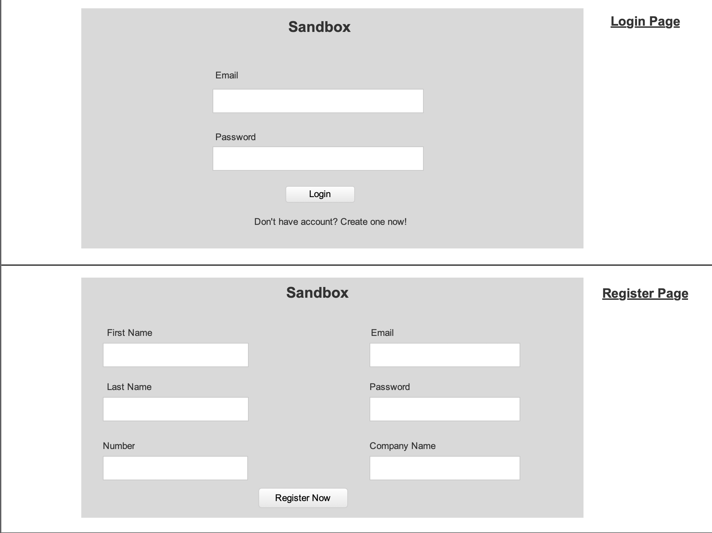
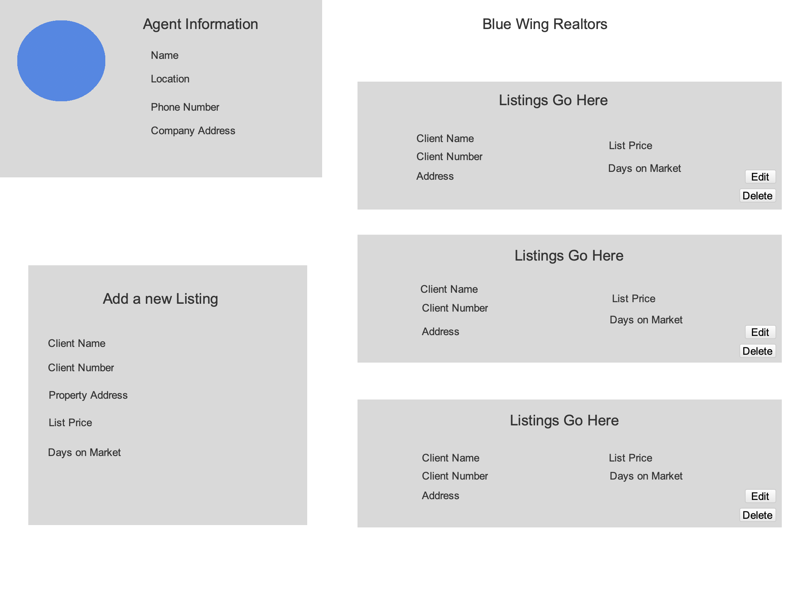
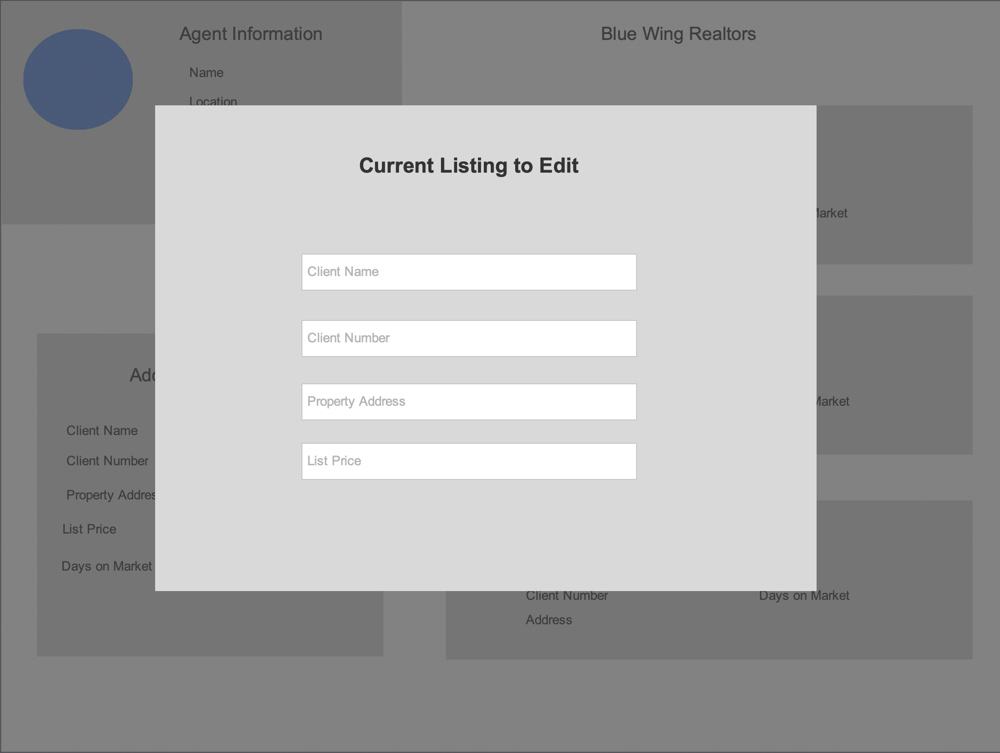

# User Stories

#Project 3 - Sandbox Application

#MVP
	
	- New Agents will come to the website and register for an account.

	- After agents register for an account they will be able to keep track of their current listings by creating a new listing in their account with client / property information.

	- Agents will be able to update or delete their listing in the event information changes or listing gets sold.

	- Agents will be able to update or delete the listing in the event information changes or listing gets sold.

	-Agents will not be able to access the app without an account.

#Stretch Goals

	- Agents will be able to email their listing to others.

	- Agents will be able to categorize their listings based on Active / Under Contract / Closed.

	- Community of agents will be able to see all available listings in an area and able to see which individual agent that listing belongs to.

	- Client table listings linked to client via through a table.

# Wire Frame:

 

